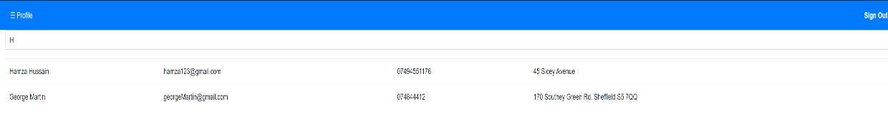
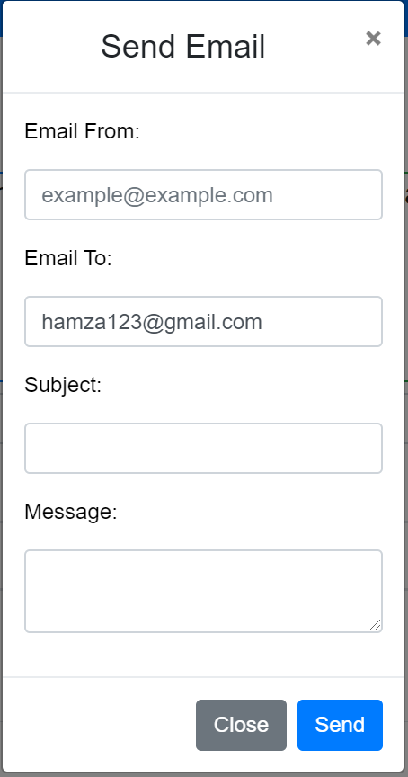
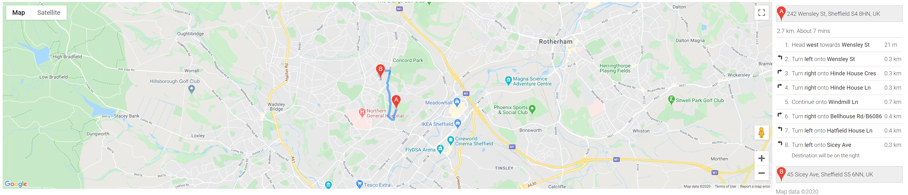

<h1 align="center">Welcome to Ehealth enhancement 👋</h1>
<p>
  
  <a href="#" target="_blank">
    
  </a>
</p>

> The project includes enhancement made to the core project. The functionality that has been implemented is the search bar. The search bar allows the user to search for patient records or patient list in real time. Second functionality is design to allow the GP to send email to their patients using a pre filled email field for the patient. Lastly a map functionailty has been implemented , which shows the gp the time it will take for them to travel to the patient location depending on there current location.

### 🏠 [Homepage](https://gitlab.com/ehealthgroup1/ehealth#readme)

### ✨ [Demo](https://young-journey-50996.herokuapp.com/)

## Prerequisites
Node js is required to install the packages and run the server.
The user must install all the dependencies inside the package.json file.
WebStorm is the recommended IDE
## Install

```sh
npm install
```
## Usage

```sh
node app.js
```
## Run tests

```sh
npm test
npm coverage - to see the current test coverage 
```
##Deployment
```

The website is hosted on the heroku platform. The git repo can be pushed on the herouku platform once it has been tested.
The gitlab pipeline auto deploys the project to heroku after the predefined tests have been passed on the master branch.
```
##Built With
[ Node.js](https://nodejs.org/en/) -To build server-side and networking applications

[ Express ](https://expressjs.com/) - The web application framework used

[Google API](https://developers.google.com/maps/documentation/javascript/tutorial) -API for the map

[Send Grid](https://app.sendgrid.com/login?redirect_to=%2F) -Server used to send email

## Author

👤 **Hamza Hussain**

* Github: [@hhussain98](https://github.com/hhussain98)

## 🤝 Contributing

Contributions, issues and feature requests are welcome!<br />Feel free to check [issues page](https://gitlab.com/ehealthgroup1/ehealth/issues). You can also take a look at the [contributing guide](https://gitlab.com/ehealthgroup1/ehealth/blob/master/CONTRIBUTING.md).

##Feature List
1.Search Bar

This allows the user to search for records or gp to search for patient in real time.

Reason: The tables will be filled with a lot of data thus allowing the gp or the patient to easily filter and view the information they require.


2.Send Email
 
This allows the gp to send email to its patient. The patient email field is prefilled with their given email.
 
Reason: The gp may want to contact the patient to ask for some details or ask them to book a appointment with the hospital



3.Map

The function shows the gp a map with direction to the patient location and how long it will take by driving.

Reason: The gp will make home visit especially to older patient thus making it easy for them to view the direction and the time it will take to visit the patient thus can prepare.


